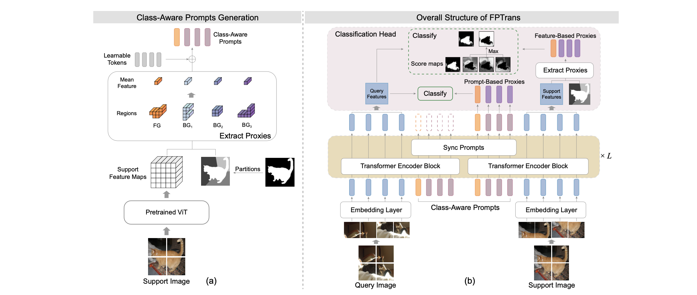

# FPTrans: Feature-Proxy Transformer for Few-Shot Segmentation

[Jian-Wei Zhang](https://github.com/Jarvis73), Yifan Sun, Yi Yang, Wei Chen

[[arXiv](https://arxiv.org/abs/2210.06908)][[Bibtex](https://github.com/Jarvis73/FPTrans#CitingFPTrans)]

This repository is the **PyTorch** Implementation. One can find the PaddlePaddle implementation from [here](https://github.com/Jarvis73/FPTransPaddle).



## Installation

Create a virtual environment and install the required packages.

```bash
conda create -n fptrans python=3.9.7
conda activate fptrans
conda install numpy=1.21.2
conda install pytorch==1.10.0 torchvision==0.11.1 cudatoolkit=11.3 -c pytorch
conda install tqdm scipy pyyaml
pip install git+https://github.com/IDSIA/sacred.git@0.8.3
pip install dropblock pycocotools python-opencv
```

Put following bash function in `~/.bashrc` for simplifying the `CUDA_VISIBLE_DEVICES`. 

```bash
function cuda()
{
    if [ "$#" -eq 0 ]; then
        return
    fi
    GPU_ID=$1
    shift 1
    CUDA_VISIBLE_DEVICES="$GPU_ID" $@
}
```

Now we can use `cuda 0 python` for single GPU and `cuda 0,1 python` for multiple GPUs. 

## Getting Started

See [Preparing Datasets and Pretrained Backbones for FPTrans](./data/README.md)

### Usage for inference with our pretrained models

Download the checkpoints of our pretrained FPTrans from [GoogleDrive](https://drive.google.com/drive/folders/1leK51aSPhw7kTJzwCY1ApcMJ5JG9K2Mv?usp=share_link) or [Baidu](https://pan.baidu.com/s/1v4PJJAe4EG1OwFnliAHEyQ) (Code: FPTr),
and put the pretrained models (the numbered folders) into `./output/`.

| Datasets  | Backbone  | #Shots | Experiment ID (Split 0 - Split 3) |
|:---------:|:---------:|:------:|:---------------------------------:|
| PASCAL-5i | ViT-B/16  | 1-shot |              1,2,3,4              |
|           | DeiT-B/16 | 1-shot |              5,6,7,8              |
|           | DeiT-S/16 | 1-shot |            9,10,11,12             |
|           | DeiT-T/16 | 1-shot |            13,14,15,16            |
|           | ViT-B/16  | 5-shot |            17,18,19,20            |
|           | DeiT-B/16 | 5-shot |            21,22,23,24            |
| COCO-20i  | ViT-B/16  | 1-shot |            25,26,27,28            |
|           | DeiT-B/16 | 1-shot |            29,30,31,32            |
|           | ViT-B/16  | 5-shot |            33,34,35,36            |
|           | DeiT-B/16 | 5-shot |            37,38,39,40            |

Run the `test` command:

```bash
# PASCAL ViT 1shot
cuda 0 python run.py test with configs/pascal_vit.yml exp_id=1 split=0

# PASCAL ViT 5shot
cuda 0 python run.py test with configs/pascal_vit.yml exp_id=17 split=0 shot=5

# COCO to PASCAL 1shot (cross domain, no need for training, just test)
# Load model trained from COCO, test on PASCAL 
# Notice: the code will use different splits from PASCAL-5i to avoid test 
#         classes (PASCAL) existed in training datasets (COCO).
cuda 0 python run.py test with configs/coco2pascal_vit.yml exp_id=29 split=0
```

### Usage for training from scratch

Run the `train` command (adjust batch size `bs` for adapting the GPU memory):

```bash
# PASCAL 1shot
cuda 0 python run.py train with split=0 configs/pascal_vit.yml

# PASCAL 5shot
cuda 0,1 python run.py train with split=0 configs/pascal_vit.yml shot=5

# COCO 1shot
cuda 0,1 python run.py train with split=0 configs/coco_vit.yml

# COCO 5shot
cuda 0,1,2,3 python run.py train with split=0 configs/coco_vit.yml shot=5 bs=8
```

Optional arguments:

* `-i <Number>`: Specify the experiment id. Default is incremental numbers in the `./output` directory (or MongoDB if used).
* `-p`: print configurations
* `-u`: Run command without saving experiment details. (used for debug)

Please refer to [Sacred Documentation](https://sacred.readthedocs.io/en/stable/index.html) for complete command line interface. 

### Performance

* Results on PASCAL-5i

|   Backbone    | Method  |  1-shot  |  5-shot  |
|:-------------:|:-------:|:--------:|:--------:|
|   ResNet-50   |  HSNet  |   64.0   |   69.5   |
|               |   BAM   |   67.8   |   70.9   |
| ViT-B/16-384  | FPTrans |   64.7   |   73.7   |
|   DeiT-T/16   | FPTrans |   59.7   |   68.2   |
|   DeiT-S/16   | FPTrans |   65.3   |   74.2   |
| DeiT-B/16-384 | FPTrans | **68.8** | **78.0** |

* Results on COCO-20i

|   Backbone    | Method  |  1-shot  |  5-shot  |
|:-------------:|:-------:|:--------:|:--------:|
|   ResNet-50   |  HSNet  |   39.2   |   46.9   |
|               |   BAM   |   46.2   |   51.2   |
| ViT-B/16-384  | FPTrans |   42.0   |   53.8   |
| DeiT-B/16-384 | FPTrans | **47.0** | **58.9** |

Notice that the results are obtained on NVIDIA A100/V100 platform. We find that the results
may have a few fluctuation on NVIDIA GeForce 3090 with exactly the same model and environment.

## Citing FPTrans

```text
@inproceedings{zhang2022FPTrans,
  title={Feature-Proxy Transformer for Few-Shot Segmentation},
  author={Jian-Wei Zhang, Yifan Sun, Yi Yang, Wei Chen},
  journal={NeurIPS},
  year={2022}
}
```
